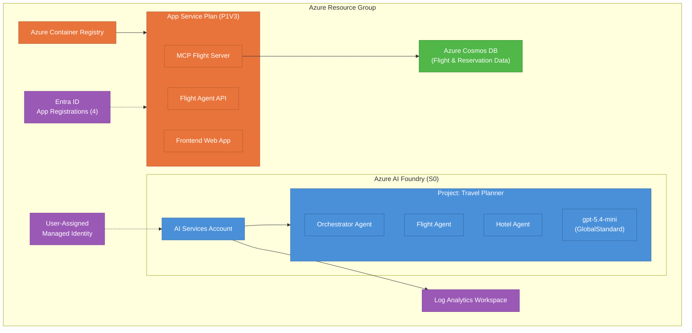
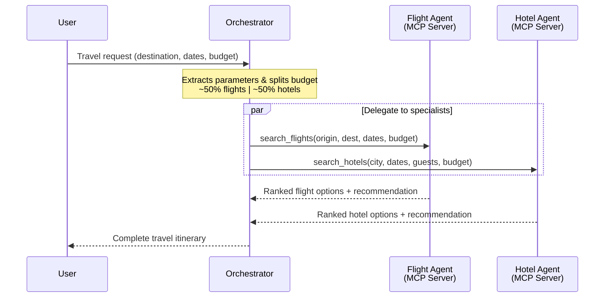

# Multi-Agent Travel Planner on Azure AI Foundry

A multi-agent orchestration demo built on **Azure AI Foundry** that coordinates specialized AI agents to create complete travel itineraries. An orchestrator agent delegates tasks to flight and hotel specialists, then synthesizes their responses into a unified travel plan.

## Architecture

### Infrastructure



### Agent Interaction Flow



## What Is Deployed

| Resource | SKU / Tier | Purpose |
|----------|-----------|---------|
| **Azure AI Foundry Account** | S0 (AI Services) | Hosts the multi-agent project |
| **Foundry Project** | — | "Travel Planner" project with orchestrator, flight, and hotel agents |
| **Model Deployment** | GlobalStandard (150 capacity) | `gpt-5.4-mini` model used by all agents |
| **App Service Plan** | PremiumV3 (P1V3, Linux) | Hosts the MCP Flight Server, Flight Agent API, and Frontend web apps |
| **MCP Flight Server** | Web App (container) | Remote MCP server exposing flight search and reservation tools |
| **Flight Agent API** | Web App (container) | REST API for the flight agent conversation service |
| **Frontend Web App** | Web App (container) | Client-facing chatbot UI |
| **Azure Container Registry** | Basic | Stores container images for the web apps |
| **Azure Cosmos DB** | GlobalDocumentDB | Flight and reservation data storage for the MCP server |
| **Log Analytics Workspace** | PerGB2018 | Centralized logging (30-day retention, 10 GB/day cap) |
| **User-Assigned Managed Identity** | — | Identity for Foundry resource access |
| **Entra ID App Registrations** | — | 4 registrations: MCP Flight Server, Flight Agent API, OpenAPI (Swagger), Frontend |

> **Note:** By default, Foundry manages its own storage, AI Search, and thread storage internally. Set `bringYourOwnResource = true` to deploy these as separate resources with VNet integration. This deployment uses public network access and is not intended for production workloads.

## Agent Architecture

| Agent | Tool Type | Tool / Endpoint | Description |
|-------|-----------|-----------------|-------------|
| **Orchestrator** | None (coordinator) | — | Decomposes travel requests, extracts parameters, splits budget, delegates to specialists, and synthesizes the final itinerary |
| **Flight Agent** | MCP Server | `flights-server` → `search_flights` | Searches flights by origin/destination, dates, cabin class, and budget. Returns ranked options with pricing |
| **Hotel Agent** | MCP Server | `hotels-server` → `search_hotels` | Searches hotels by city, dates, star rating, amenities, and budget. Returns ranked options with ratings |

All agents currently use **mock data** from `agents/mock-data/` (flights.json, hotels.json) for demonstration purposes.

## Prerequisites

Install the following tools on your machine before deploying:

| Tool | Version | Install |
|------|---------|---------|
| **Azure Developer CLI (`azd`)** | v1.x+ | [Install azd](https://learn.microsoft.com/azure/developer/azure-developer-cli/install-azd) |
| **Azure CLI (`az`)** | Latest | [Install Azure CLI](https://learn.microsoft.com/cli/azure/install-azure-cli) |
| **PowerShell 7+** (`pwsh`) | 7.x+ | [Install PowerShell](https://learn.microsoft.com/powershell/scripting/install/installing-powershell) |
| **Git** | Latest | [Install Git](https://git-scm.com/downloads) |

**Azure requirements:**
- An Azure subscription with **Contributor** or **Owner** role
- A region that supports Azure AI Foundry (e.g., East US, West US 2, Sweden Central, West Europe)

## Deployment

### 1. Clone the repository

```bash
git clone https://github.com/<your-org>/multi-agent-foundry-demo.git
cd multi-agent-foundry-demo
```

### 2. Authenticate

```bash
azd auth login
```

### 3. Deploy infrastructure and agents

```bash
azd up
```

You will be prompted for:
- **Environment name** — a unique name for this deployment (used in resource naming)
- **Azure subscription** — the target subscription
- **Azure location** — the region to deploy to (must support Azure AI Foundry)

This command will:
1. Provision all Azure resources defined in `infra/main.bicep`
2. Run the **post-provision hook** (`scripts/postprovision.ps1`) which configures the project-level capability host with:
   - Vector store connection → Azure AI Search
   - Storage connection → Azure Storage Account
   - Thread storage → Azure Cosmos DB

### 4. Verify deployment

Once complete, navigate to [Azure AI Foundry Studio](https://ai.azure.com) and open the **Travel Planner** project to interact with the agents.

## Clean Up

To delete all deployed resources:

```bash
azd down
```

Or use the included cleanup script to remove resource groups matching the environment pattern:

```powershell
./cleanup-resource-groups.ps1
```

## Project Structure

```
├── azure.yaml                  # Azure Developer CLI project configuration
├── infra/
│   ├── main.bicep              # Main infrastructure template
│   ├── main.parameters.json    # Parameter definitions
│   └── core/
│       ├── ai/                 # Foundry account, project, capability hosts
│       ├── identity/           # User-assigned managed identity
│       ├── monitoring/         # Log Analytics workspace
│       └── rbac/               # Role assignments
├── agents/
│   ├── orchestrator.md         # Orchestrator agent instructions
│   ├── flight-agent.md         # Flight specialist instructions
│   ├── hotel-agent.md          # Hotel specialist instructions
│   └── mock-data/              # Sample data for agent tools
└── scripts/
    └── postprovision.ps1       # Post-deployment capability host setup
```

## License

See [LICENSE](LICENSE) for details.
