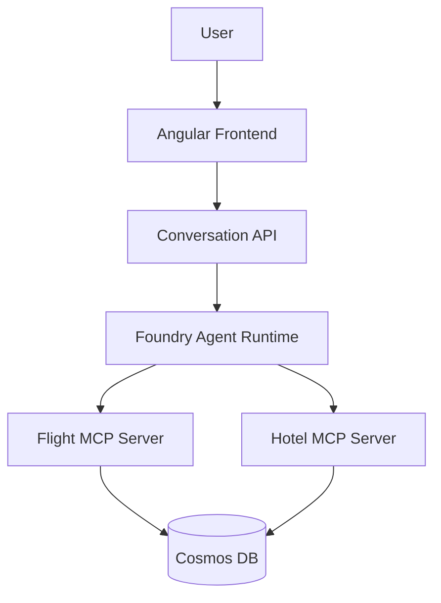

# Multi-Agent Foundry Demo

A multi-agent travel planner built on Microsoft Foundry with MCP tool servers, demonstrating end-to-end infrastructure provisioning, OAuth-secured MCP connections, and a conversational frontend.

## Getting Started

| Step | Documentation |
|------|--------------|
| 1. Configure secrets & permissions | [Prerequisites](docs/prerequisites.md) |
| 2. Deploy infrastructure | [Pipeline Overview](docs/pipeline-overview.md) |
| 3. Load seed data into Cosmos DB | [Load Data](docs/load-data.md) |
| 4. Deploy applications | [Deploy Apps](docs/deploy-apps.md) |
| 5. Deploy Foundry MCP connection | [Deploy Foundry Connection](docs/deploy-foundry-connection.md) |
| 6. Understand the Foundry architecture | [Foundry & Capability Host Setup](docs/foundry-setup.md) |

## Architecture at a Glance



## Repository Structure

```
.github/workflows/   GitHub Actions pipelines (infra, app deploy)
infra/               Bicep modules for all Azure resources
src/
  api/               Conversation API (Python/FastAPI)
  frontend/          Angular chat UI
  mcp/               MCP tool servers (Flight, Hotel, Reservation)
scripts/             Post-provisioning scripts (connections, consent)
docs/                Detailed documentation
```

## Quick Reference

| Resource | Location |
|----------|----------|
| Infrastructure pipeline | `.github/workflows/infra.yaml` |
| App deployment pipeline | `.github/workflows/apps.yml` |
| Foundry connection pipeline | `.github/workflows/deploy-foundry-connection.yaml` |
| Bicep entry point | `infra/main.bicep` |
| MCP Flight Server | `src/mcp/flight-server/` |
| MCP Hotel Server | `src/mcp/hotel-server/` |
| Conversation API | `src/api/conversation-api/` |
| Frontend | `src/frontend/` |