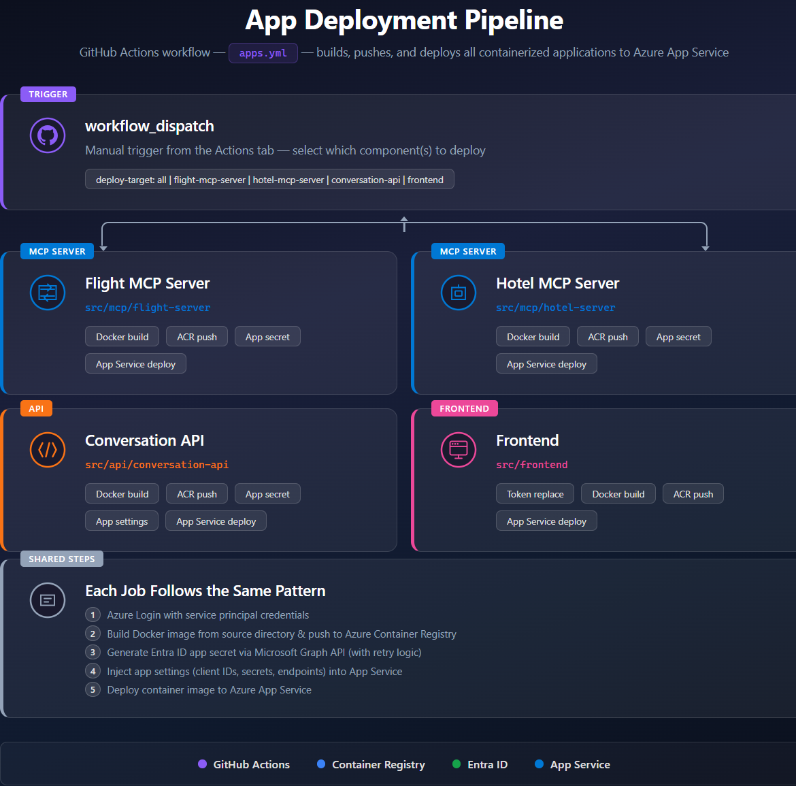

# Deploy Applications

After the infrastructure is provisioned and seed data is loaded, deploy the containerized applications by running the **Deploys Apps** workflow.

> **Prerequisite:** The `infra.yaml` pipeline must have completed successfully. All secrets consumed by this workflow (`AZURE_CONTAINER_REGISTRY_NAME`, `MCP_FLIGHT_WEBAPP_NAME`, `FLIGHT_MCP_SERVER_CLIENT_ID`, etc.) are auto-populated by the infrastructure pipeline.

## Pipeline overview

The `apps.yml` workflow builds Docker images, pushes them to Azure Container Registry, and deploys four independent applications to Azure App Service:

| Job | Image | App Service | Source |
|-----|-------|-------------|--------|
| **deploy-flight-mcp-server** | `mcp-flight-server` | `MCP_FLIGHT_WEBAPP_NAME` | `src/mcp/flight-server` |
| **deploy-hotel-mcp-server** | `mcp-hotel-server` | `MCP_HOTEL_WEBAPP_NAME` | `src/mcp/hotel-server` |
| **deploy-conversation-api** | `conversation-api` | `CONVERSATION_API_WEBAPP_NAME` | `src/api/conversation-api` |
| **deploy-frontend** | `frontend` | `FRONTEND_RESOURCE_NAME` | `src/frontend` |

All four jobs are **independent** — they run in parallel and can be triggered individually.

## Run the pipeline

Trigger the **Deploys Apps** workflow from the **Actions** tab. It uses `workflow_dispatch` (manual trigger only).

### Workflow input

| Input | Default | Description |
|-------|---------|-------------|
| `deploy-target` | `all` | Which component(s) to deploy. Use `all` for a full deployment, or pick an individual app for a targeted re-deploy |

### Options

- `all` — Deploy everything in parallel
- `flight-mcp-server` — Flight MCP Server only
- `hotel-mcp-server` — Hotel MCP Server only
- `conversation-api` — Conversation API only
- `frontend` — Frontend only

## What each job does

Every job follows the same pattern:

1. **Azure Login** — Authenticate with the service principal from `AZURE_CREDENTIALS`
2. **Build & push** — Build a Docker image from the source directory and push it to ACR (tagged with both `latest` and the commit SHA)
3. **Generate app secret** — Create a new Entra ID client secret via Microsoft Graph API (with retry logic for concurrency conflicts)
4. **Set app settings** — Inject environment variables (client IDs, secrets, endpoints) into the App Service
5. **Deploy** — Deploy the container image to the target App Service

### MCP Servers (Flight & Hotel)

Both MCP server jobs are identical in structure. They inject two app settings:

| Setting | Value |
|---------|-------|
| `ENTRA_CLIENT_ID` | The MCP server's Entra app registration client ID |
| `ENTRA_CLIENT_SECRET` | A freshly generated app secret |

### Conversation API

The Conversation API job injects additional settings for the Foundry agent integration:

| Setting | Value |
|---------|-------|
| `AZURE_CLIENT_ID` | Conversation API client ID |
| `CLIENT_ID` | Conversation API client ID |
| `CLIENT_SECRET` | Freshly generated app secret |
| `OPENAPI` | OpenAPI/Swagger client ID |

### Frontend

The frontend job has an extra **token replacement** step before the Docker build. It uses `sed` to inject runtime values into `src/app/environments/environment.prod.ts`:

| Token | Replaced with |
|-------|--------------|
| `__clientId__` | Front-End Chatbot app registration ID |
| `__authority__` | `https://login.microsoftonline.com/{TENANT_ID}` |
| `__apiScopes__` | `api://{CONVERSATION_API_WEBAPP_NAME}/user_impersonation` |
| `__apiBaseUrl__` | `https://{CONVERSATION_API_WEBAPP_NAME}.azurewebsites.net` |
| `__redirectUrl__` | `https://{FRONTEND_RESOURCE_NAME}.azurewebsites.net` |
| `__appInsightKey__` | Application Insights connection string |

> The frontend does **not** generate an app secret — authentication is handled client-side via MSAL/PKCE.

## Re-deploying individual apps

After the first full deployment, you can re-deploy a single component by selecting it from the `deploy-target` dropdown. This is useful when:

- You pushed a code change to one service only
- An app secret needs rotation (the job generates a new one automatically)
- App settings changed and need to be re-injected
