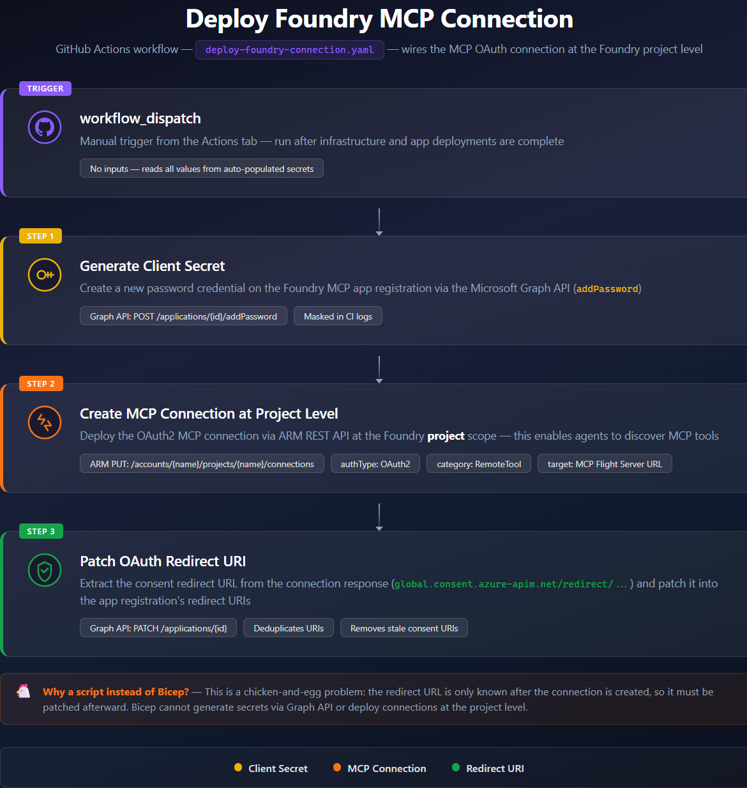

# Deploy Foundry MCP Connection

After the infrastructure is provisioned and applications are deployed, run the **Deploy Foundry MCP Connection** workflow to wire the MCP OAuth connection at the Foundry project level.

> **Prerequisite:** Both `infra.yaml` and `apps.yml` must have completed successfully. The MCP Flight and Hotel Server App Services must be running so the connection target URLs are valid.

## Pipeline overview



The `deploy-foundry-connection.yaml` workflow runs a single shell script (`scripts/deploy-foundry-connection.sh`) that deploys **two** Foundry project-level connections — one for the Flight MCP server and one for the Hotel MCP server. For each connection, the script performs three imperative steps Bicep cannot handle declaratively.

## Why a script instead of Bicep?

This is a **chicken-and-egg problem**:

1. **Client secrets** can only be generated via the Microsoft Graph API (`addPassword`) — Bicep has no primitive for this.
2. **Project-level connections** must be created via the ARM REST API at the `/accounts/{name}/projects/{name}/connections` path — Bicep only supports account-level connections.
3. **The OAuth redirect URI** is only known _after_ the connection is created. It must be read from the response and patched back into the app registration.

## Steps

### Step 1 — Generate Client Secret

The script looks up the Entra ID app registration by its `appId` and creates a new password credential via the Graph API:

```
POST https://graph.microsoft.com/v1.0/applications/{objectId}/addPassword
```

The secret is masked in GitHub Actions logs (`::add-mask::`) and used in the next step.

### Step 2 — Create MCP Connection at Project Level

An ARM REST `PUT` creates (or updates) each connection resource under the Foundry **project**:

```
PUT .../connections/flightserver-mcp
PUT .../connections/hotelserver-mcp
```

The connection payload includes:

| Property | Flight | Hotel |
|----------|--------|-------|
| `authType` | `OAuth2` | `OAuth2` |
| `category` | `RemoteTool` | `RemoteTool` |
| `target` | `https://{MCP_FLIGHT_WEBAPP_NAME}.azurewebsites.net/mcp` | `https://{MCP_HOTEL_WEBAPP_NAME}.azurewebsites.net/mcp` |
| `scopes` | `api://{flight}/flight_reservation_information` | `api://{hotel}/hotel_reservation_information` |

### Step 3 — Patch OAuth Redirect URI

After the connection is created, Azure returns a consent redirect URL (`global.consent.azure-apim.net/redirect/...`). The script:

1. Extracts the redirect URL from the connection response (checking multiple property paths for compatibility)
2. Fetches the app registration's current redirect URIs via Graph API
3. Removes any stale consent URIs and adds the new one (deduplicated)
4. Patches the app registration if the URI set has changed

```
PATCH https://graph.microsoft.com/v1.0/applications/{objectId}
{ "web": { "redirectUris": [...] } }
```

## Environment variables

All values are injected from GitHub secrets (auto-populated by the infrastructure pipeline):

| Variable | Description |
|----------|-------------|
| `FOUNDRY_CONNECTION_MCP_CLIENT_ID` | App ID of the Entra app registration for the Flight MCP connection |
| `FOUNDRY_CONNECTION_HOTEL_MCP_CLIENT_ID` | App ID of the Entra app registration for the Hotel MCP connection |
| `AZURE_RESOURCE_GROUP` | Resource group containing the Foundry resource |
| `MCP_FLIGHT_WEBAPP_NAME` | Name of the MCP Flight Server App Service |
| `MCP_HOTEL_WEBAPP_NAME` | Name of the MCP Hotel Server App Service |
| `FOUNDRY_RESOURCE_NAME` | Name of the Foundry (Cognitive Services) account |
| `PROJECT_NAME` | Name of the Foundry project |

`TENANT_ID` and `SUBSCRIPTION_ID` are auto-detected from the current `az` login if not explicitly set.

## Run the pipeline

Trigger the **Deploy Foundry MCP Connection** workflow from the **Actions** tab. It uses `workflow_dispatch` (manual trigger, no inputs).

## Running locally

The underlying script can also be run directly with the Azure CLI:

```bash
export FOUNDRY_CONNECTION_MCP_CLIENT_ID=<flight-app-id>
export FOUNDRY_CONNECTION_HOTEL_MCP_CLIENT_ID=<hotel-app-id>
export AZURE_RESOURCE_GROUP=<rg-name>
export MCP_FLIGHT_WEBAPP_NAME=<flight-webapp-name>
export MCP_HOTEL_WEBAPP_NAME=<hotel-webapp-name>
export FOUNDRY_RESOURCE_NAME=<foundry-name>
export PROJECT_NAME=<project-name>

az login
./scripts/deploy-foundry-connection.sh
```
