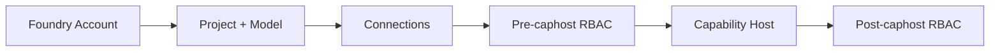
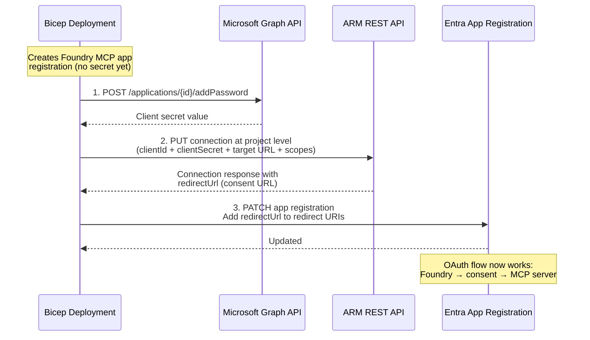

# Foundry & Capability Host Setup

## Architecture

The Foundry deployment follows the [official sample pattern](https://github.com/microsoft-foundry/foundry-samples/tree/main/infrastructure/infrastructure-setup-bicep/43-standard-agent-setup-with-customization) with these key resources:

| Resource | Module | Purpose |
|----------|--------|---------|
| AI Services account | `core/ai/foundry.bicep` | Foundry account with `allowProjectManagement: true` |
| Project | `core/ai/foundry.bicep` | Travel Planner project with SystemAssigned identity |
| Model deployment | `core/ai/foundry.bicep` | GPT model for agent inference |
| Connections | `core/ai/foundry.bicep` | Storage, AI Search, Cosmos DB (BYO mode) |
| Capability host | `core/ai/capability-hosts.bicep` | Project-level only — enables agent runtime |
| Pre-caphost RBAC | `core/rbac/foundry.bicep` | Storage, AI Search, Cosmos DB roles for project identity |
| Post-caphost RBAC | `core/rbac/post-caphost.bicep` | Container-scoped roles with ABAC conditions |

**Deployment order:**



## MCP OAuth Connection Flow

The `deploy-foundry-connection.sh` script handles a chicken-and-egg problem that Bicep cannot solve:



**Why these steps are imperative (not Bicep):**

| Step | Why |
|------|-----|
| Generate client secret | Graph API `addPassword` — Bicep cannot create secrets |
| Deploy connection at project level | Bicep creates account-level; project-level requires ARM REST |
| Patch redirect URI | URI is only known after connection creation (chicken-and-egg) |

## Gotchas & Lessons Learned

### 1. Do NOT create an explicit account-level capability host with BYO VNet

When `networkInjections` is configured with `scenario: 'agent'`, Azure **auto-creates** an account-level capability host ~5 seconds after the account PUT. Deploying a second explicit one causes:

```
The customerSubnet property must match the subnet recorded on the Foundry account. (Code: UserError)
```

**Fix:** Only deploy the project-level capability host. The account-level one is managed by Azure.

### 2. Split Foundry resources out of nested pattern

Defining the project and model deployment as nested resources inside the account causes ARM to treat the entire block as one atomic operation. If the model deployment takes 15–20 minutes, the account resource stays in "Running" state the entire time (and can appear stuck).

**Fix:** Define account, project, and model deployment as separate top-level resources with `parent` references. ARM then deploys and reports on each independently.

### 3. Register `Microsoft.AlertsManagement` before deploying

Application Insights auto-creates smart detection alert rules that require `Microsoft.AlertsManagement`. If not registered, the deployment fails with `MissingSubscriptionRegistration` — even though it looks like an unrelated error.

```bash
az provider register --namespace Microsoft.AlertsManagement --wait
```

### 4. Post-caphost RBAC must be scoped to agent containers

The official Foundry pattern uses a **two-phase RBAC** approach:

- **Before capability host:** Broad roles (Storage Blob Data Contributor, Cosmos DB Operator)
- **After capability host:** Container-scoped roles using ABAC conditions targeting `*-azureml-agent` storage containers and the `enterprise_memory` Cosmos DB database

This avoids granting blanket Storage Blob Data Owner to the project identity.

### 5. Capability host deployment can take 5–15 minutes

This is normal. The agent runtime provisions infrastructure behind the scenes. If it exceeds 30 minutes, check for stuck state and consider deleting the capability host via REST API:

```bash
az rest --method DELETE --url "https://management.azure.com/subscriptions/{sub}/resourceGroups/{rg}/providers/Microsoft.CognitiveServices/accounts/{account}/projects/{project}/capabilityHosts/{name}?api-version=2025-04-01-preview"
```

### 6. Use API version `2025-04-01-preview`

The `2026-01-15-preview` API version can trigger additional auto-provisioning (monitoring alerts) during project creation that causes failures. The `2025-04-01-preview` version used by the official samples is more stable.

### 7. Capability hosts cannot be updated — only delete and recreate

Per the [Foundry networking blog post](https://techcommunity.microsoft.com/blog/azure-ai-foundry-blog/the-hidden-reason-your-foundry-agent-cant-reach-any-of-your-private-bring-your-o/4543619), capability hosts don't support PATCH. If you change a connection name or configuration, you must delete the capability host and recreate it. Same name + different config returns 400. A second host with a different name returns 409.

```bash
# Delete project-level capability host
az rest --method DELETE --url "https://management.azure.com/subscriptions/{sub}/resourceGroups/{rg}/providers/Microsoft.CognitiveServices/accounts/{account}/projects/{project}/capabilityHosts/project-capability-host?api-version=2025-04-01-preview"
```

### 8. Project capability host is what actually wires your BYO resources

There is **no inheritance** from account to project. Account-level connections with `isSharedToAll: true` make them *visible* to the project, but the project capability host must explicitly reference them. Without a project-level capability host, Agent Service silently uses Microsoft-managed resources or fails with network-like errors. See [this blog post](https://techcommunity.microsoft.com/blog/azure-ai-foundry-blog/the-hidden-reason-your-foundry-agent-cant-reach-any-of-your-private-bring-your-o/4543619) for the full explanation.
