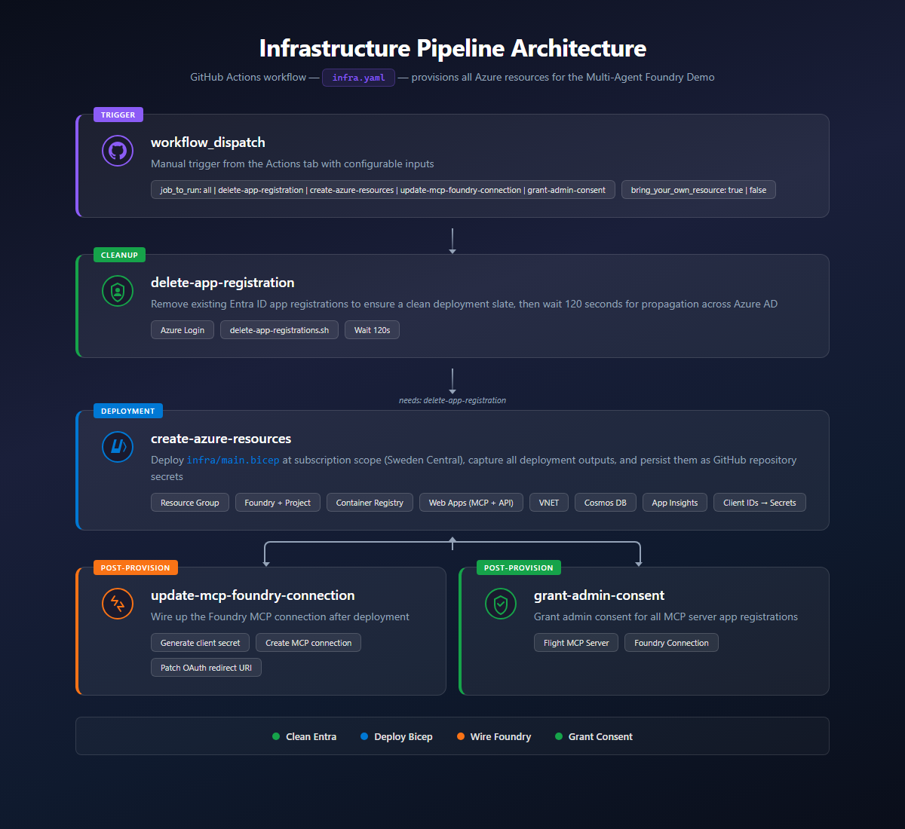
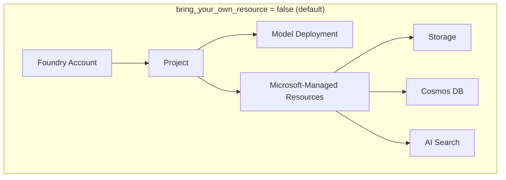
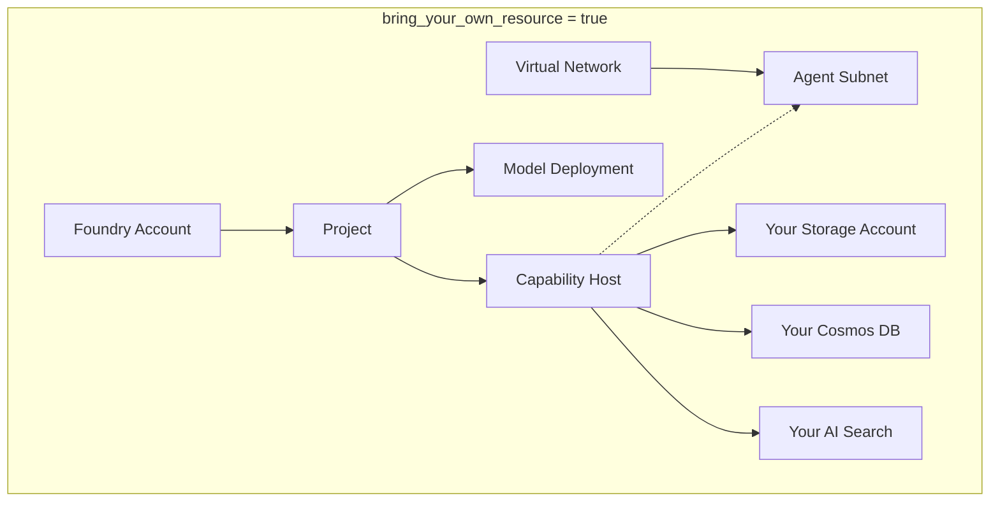

# Pipeline Overview

The `infra.yaml` workflow provisions all Azure resources for the Multi-Agent Foundry Demo via four sequential/parallel jobs.

## Jobs

| Job | Purpose |
|-----|---------|
| **delete-app-registration** | Remove existing Entra ID app registrations for a clean slate; wait 120s for propagation |
| **create-azure-resources** | Deploy `infra/main.bicep` at subscription scope, capture outputs (resource names, client IDs), and persist them as GitHub repository secrets |
| **update-mcp-foundry-connection** | Generate a client secret, create/update the MCP connection at the Foundry project level, patch the OAuth redirect URI |
| **grant-admin-consent** | Grant admin consent for all MCP server app registrations |

> The last two jobs run **in parallel** after `create-azure-resources` completes.

## Run the Pipeline

Once all [prerequisites](prerequisites.md) are configured, trigger the **Create Azure resources** workflow from the **Actions** tab.

### Workflow inputs

| Input | Default | Description |
|-------|---------|-------------|
| `job_to_run` | `all` | Which job(s) to execute. Use `all` for a full deployment, or pick individual jobs for targeted re-runs |
| `bring_your_own_resource` | `false` | When `true`, deploys a VNet, Cosmos DB, AI Search, and Storage account that are wired into Foundry via a project-level capability host. When `false`, Foundry uses Microsoft-managed resources |

### BYO vs Non-BYO Architecture

**When to use `bring_your_own_resource = true`:**
- You need network isolation (VNet integration for the agent runtime)
- You want full control over data residency and encryption (CMK on Cosmos/Storage)
- You need to connect the agent to existing data stores

**When to keep `false` (default):**
- Quick demo or dev environment
- You don't need VNet isolation
- Simpler deployment (fewer resources, faster provisioning)

### Auto-populated secrets

The `create-azure-resources` job uses `gh secret set` to persist **17 outputs** from the Bicep deployment as repository secrets. These are consumed by downstream workflows (app deployment, MCP connection setup).

You do **not** need to create these manually — they are overwritten on every run:

| Secret | Source |
|--------|--------|
| `AZURE_RESOURCE_GROUP` | Resource group name |
| `VIRTUAL_NETWORK_RESOURCE_NAME` | VNet name (empty if BYO = false) |
| `COSMOS_DB_NAME` | Cosmos DB account name |
| `FLIGHT_MCP_SERVER_CLIENT_ID` | Entra app ID for Flight MCP Server |
| `HOTEL_MCP_SERVER_CLIENT_ID` | Entra app ID for Hotel MCP Server |
| `FOUNDRY_CONNECTION_MCP_CLIENT_ID` | Entra app ID for Foundry MCP connection |
| `MCP_FLIGHT_WEBAPP_NAME` | App Service name for Flight MCP |
| `MCP_HOTEL_WEBAPP_NAME` | App Service name for Hotel MCP |
| `AZURE_CONTAINER_REGISTRY_NAME` | ACR name |
| `BRING_YOUR_OWN_RESOURCE` | Whether BYO was used |
| `CONVERSATION_API_WEBAPP_NAME` | App Service name for Conversation API |
| `FRONTEND_RESOURCE_NAME` | App Service name for the frontend |
| `FOUNDRY_RESOURCE_NAME` | AI Services account name |
| `PROJECT_NAME` | Foundry project name |
| `AZURE_OPENAI_MODEL` | Deployed model name |
| `APPLICATION_INSIGHT_RESOURCE_NAME` | App Insights name |
| `CONVERSATION_API_CLIENT_ID` | Entra app ID for Conversation API |
| `OPENAPI_CLIENT_ID` | Entra app ID for OpenAPI/Swagger |

### Re-running individual jobs

After the first full run, you can re-run individual jobs:

- **`update-mcp-foundry-connection`** — Useful if the MCP connection needs a new secret rotation or redirect URI changed
- **`grant-admin-consent`** — If consent was revoked or a new app was added
- **`delete-app-registration`** — Wipes all app registrations for a clean re-deploy (always followed by `create-azure-resources`)

> **Note:** Running `delete-app-registration` alone without `create-azure-resources` will break downstream workflows since the app IDs stored in secrets will be invalid.
