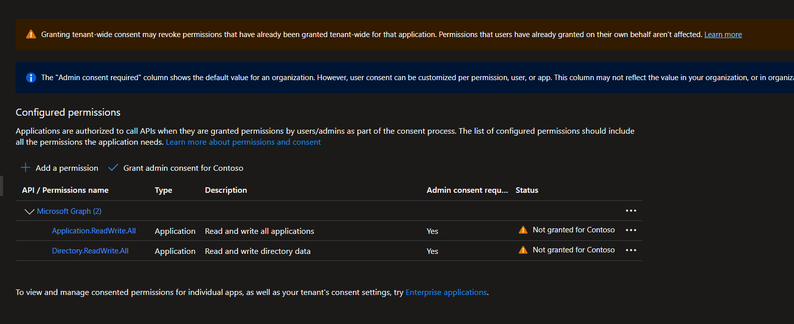
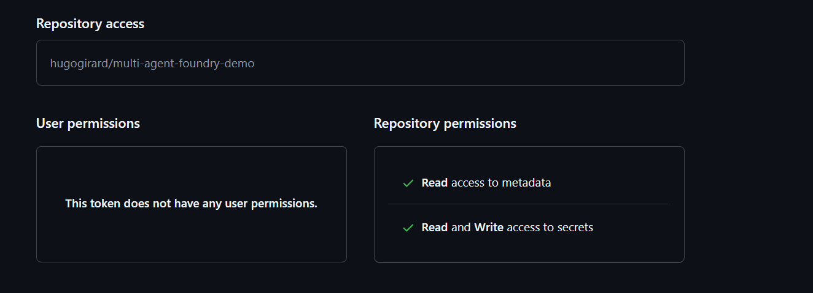

# Prerequisites

Before running the infrastructure pipeline, you need to configure the following GitHub secrets and ensure your Azure subscription is ready.

## Step 1 — Create a Service Principal

Create a Service Principal with **Owner** role on your Azure subscription:

```bash
az ad sp create-for-rbac --name "multi-agent-foundry-demo" --role Owner --scopes /subscriptions/<SUBSCRIPTION_ID>
```

> Replace `<SUBSCRIPTION_ID>` with your Azure subscription ID. The Owner role is required because the deployment creates resources at subscription scope.

## Step 2 — Save the `AZURE_CREDENTIALS` secret

The command above outputs something like:

```json
{
  "appId": "xxx-xxxx-xxxxx-xxxxx",
  "displayName": "multi-agent-foundry-demo",
  "password": "xxx-xxxx-xxxxx-xxxxx",
  "tenant": "xxx-xxxx-xxxxx-xxxxx"
}
```

Transform it into the format expected by the [Azure/login](https://github.com/Azure/login) GitHub Action and save it as a repository secret named **`AZURE_CREDENTIALS`**:

```json
{
  "clientId": "<appId>",
  "clientSecret": "<password>",
  "subscriptionId": "<SUBSCRIPTION_ID>",
  "tenantId": "<tenant>",
  "activeDirectoryEndpointUrl": "https://login.microsoftonline.com",
  "resourceManagerEndpointUrl": "https://management.azure.com/",
  "activeDirectoryGraphResourceId": "https://graph.windows.net/",
  "sqlManagementEndpointUrl": "https://management.core.windows.net:8443/",
  "galleryEndpointUrl": "https://gallery.azure.com/",
  "managementEndpointUrl": "https://management.core.windows.net/"
}
```

## Step 3 — Grant Microsoft Graph API permissions to the Service Principal

The deployment registers Entra ID app registrations, so the Service Principal needs the following Microsoft Graph **Application** permissions:

| Permission | Type | Description |
|---|---|---|
| `Application.ReadWrite.All` | Application | Read and write all applications |
| `Directory.ReadWrite.All` | Application | Read and write directory data |

**Via CLI:**

```bash
SP_APP_ID="<appId from Step 1>"

az ad app permission add --id $SP_APP_ID \
  --api 00000003-0000-0000-c000-000000000000 \
  --api-permissions 1bfefb4e-e0b5-418b-a88f-73c46d2cc8e9=Role 19dbc75e-c2e2-444c-a770-ec69d8559fc7=Role

az ad app permission admin-consent --id $SP_APP_ID
```

**Via Azure Portal:**

Navigate to **Entra ID** → **App registrations** → select the `multi-agent-foundry-demo` app → **API permissions** → **Grant admin consent**.



> **Important:** The identity running the workflow must also hold **Global Administrator** or **Privileged Role Administrator** in Entra ID for the `grant-admin-consent` job to succeed.

## Step 4 — Create the `PA_TOKEN` secret

The workflow uses `gh secret set` to persist deployment outputs as repository secrets. This requires a GitHub **Fine-Grained Personal Access Token**.

1. Go to **GitHub** → **Settings** → **Developer settings** → **Personal access tokens** → **Fine-grained tokens** → **Generate new token**
2. Set **Repository access** to only this repository
3. Under **Repository permissions**, grant:
   - **Metadata**: Read
   - **Secrets**: Read and Write



4. Save the generated token as a repository secret named **`PA_TOKEN`**

## Step 5 — Register required resource providers

Application Insights auto-creates smart detection alert rules that require `Microsoft.AlertsManagement`. If this provider isn't registered, the deployment fails with `MissingSubscriptionRegistration`.

```bash
az provider register --namespace Microsoft.AlertsManagement --wait
az provider register --namespace Microsoft.CognitiveServices --wait
```

## Summary of manually-created secrets

| Secret | Source |
|--------|--------|
| `AZURE_CREDENTIALS` | Step 2 — Service principal JSON |
| `PA_TOKEN` | Step 4 — GitHub fine-grained PAT |

All other secrets (resource names, client IDs, etc.) are **auto-populated** by the `create-azure-resources` job from Bicep deployment outputs. Do not create them manually.
