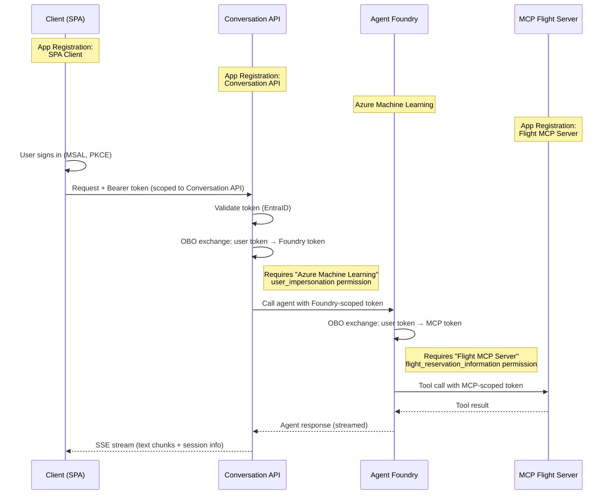

# Conversation API

## Architecture

The solution follows a multi-hop On-Behalf-Of (OBO) authentication flow where each service has its own Entra ID identity.

## Authentication Flow

Each arrow in the diagram represents a token exchange via the **On-Behalf-Of (OBO)** flow:

| Hop | From | To | Permission Required |
|-----|------|----|---------------------|
| 1 | SPA | Conversation API | `api://<API_CLIENT_ID>/user_impersonation` |
| 2 | Conversation API | Azure Machine Learning (Foundry) | `Azure Machine Learning / user_impersonation` |
| 3 | Agent Foundry | Flight MCP Server | `api://<MCP_CLIENT_ID>/flight_reservation_information` |

### Why each permission is needed

The OBO flow allows a middle-tier service to request a token for a downstream resource **on behalf of the signed-in user**. For EntraID to authorize each exchange, the calling app registration must:

1. **Declare** the downstream API permission (API permissions blade)
2. **Have admin consent granted** for the tenant (or user consent if allowed)

Without these, EntraID returns `AADSTS65001 (consent_required)` because it has no record that the app is allowed to request tokens for that downstream resource.

## Environment Variables

| Variable | Description |
|----------|-------------|
| `AGENT_NAME` | Foundry agent name |
| `AGENT_VERSION` | Foundry agent version |
| `AZURE_CLIENT_ID` | Managed identity client ID (for deployed scenarios) |
| `TENANT_ID` | Entra ID tenant ID |
| `CLIENT_ID` | Conversation API app registration client ID |
| `CLIENT_SECRET` | Conversation API app registration client secret |
| `FOUNDRY_PROJECT_ENDPOINT` | Azure AI Foundry project endpoint |
| `OPENAPI` | OpenAPI/Swagger client ID (for Swagger UI OAuth) |
| `SCOPE_URI` | API scope URI |
